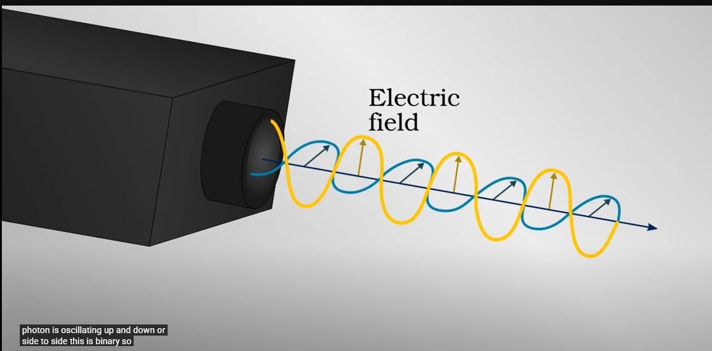

# Introduction to Quantum Protocols

Created: 2025年6月15日 13:07
Reviewed: No

**Useful Definitions:**

**Protocol: l** is a set of agreed-upon rules, procedures, or conventions that govern the interaction and communication between two or more entities. Think of it as a shared language and etiquette that allows participants to understand each other and achieve a common goal.

> Like the Japanese custom of removing one’s shoes when arriving at the home, is a standard practice that both members agree upon, and they follow it knowing the meaning of each others
> 

In **computer science**, a protocol is a formal set of rules, formats, and procedures for transmitting data between electronic devices. It dictates how information is structured, sent, received, and interpreted, ensuring that different systems can "speak the same language" and exchange data effectively

We can remark the following **properties**, and later we see how are their manifested in the specific case of **Quantum Protocols**

- **Rules and Procedures:** They define the specific steps and actions that entities must follow during communication.
- **Syntax:** They specify the structure and format of the messages exchanged (e.g., data format, encoding, signal representation).
- **Semantics:** They define the meaning of the exchanged messages, including control information, commands, and error handling instructions.
- **Timing/Synchronization:** They govern the sequence and timing of events, ensuring that messages are sent and received in the correct order and at the appropriate pace.
- **Interoperability:** By adhering to a common protocol, diverse systems and devices can communicate and work together seamlessly.
- **Error Handling:** Many protocols include mechanisms for detecting and recovering from errors that may occur during transmission.
- **Layered Architecture:** Complex protocols are often designed in layers (e.g., the OSI model), where each layer handles a specific aspect of communication, building upon the services of lower layers.
- **Standards:** Protocols are often established as standards by international or industry-wide organizations (e.g., TCP/IP, HTTP, SMTP).

| Feature/Characteristic | Classical Protocols (e.g., TCP/IP, HTTPS) | Quantum Protocols (e.g., BB84 QKD, Teleportation) |
| --- | --- | --- |
| Underlying Physics | Classical Mechanics, Electromagnetism | Quantum Mechanics |
| Information Unit | Bits (0 or 1) | Qubits (0, 1, or superposition of both) |
| Key Principles | Mathematical algorithms, computational complexity | Superposition, Entanglement, No-Cloning Theorem, Measurement Postulate, Uncertainty Principle |
| Security Basis | Computational hardness of mathematical problems (e.g., factoring large numbers) | Laws of physics; attempt to measure disturbs the quantum state, making eavesdropping detectable. |
| Detection of Eavesdropping | Difficult to detect; relies on computational assumptions | Inherent detection due to quantum measurement principles; any interception fundamentally alters the state. |
| Communication Channels | Classical channels (e.g., electrical signals, radio waves, optical fiber) | Quantum channels (e.g., transmitting photons) often alongside classical channels (for public discussion) |
| Hardware Requirements | Standard computing hardware (processors, memory, network cards) | Specialized quantum hardware (e.g., single-photon detectors, entangled photon sources, quantum gates, cryostats) |
| Scalability & Range | Highly scalable, global reach (Internet) | Currently limited in range and scalability due to decoherence and loss in quantum channels. |
| Error Correction | Classical error detection/correction codes | Quantum error correction (more complex due to delicate quantum states) |
| Purpose Examples | Data transfer, web Browse, email, remote login | Secure key distribution, state transfer, quantum computation building blocks |

**2l Qubit:** 2-Level Qubit, which is a fundamental unit of  Quantum Information , representing the quantum equivalent of a classical binary bit It is a two-state quantum-mechanical system where certain properties can be measured in binary positions, such as 'up' or 'down'.

- When **Measured a Qubit** in the Superposition **State** it collides **truly** **randomly** ( which is why it is useful in cryptography applications ) into either state 0 or 1 having assigned a **direction for the basis**
- It is defined as a **ray** in 2-**Dimensional Hilbert Space**

**Dirac Notation ( Bra-Ket )** 

- A **ket** is of the form $|v\rangle$  Mathematically it denotes a vector,  ${\displaystyle {\boldsymbol {v}}}$, in an abstract (complex) vector space ${\displaystyle V}$, and physically it represents a state of some quantum system.

- A **bra** is of the form ${\displaystyle \langle f|}$. Mathematically it denotes a linear form ${\displaystyle f:V\to \mathbb {C} }$ , i.e. a linear map that maps each vector in  ${\displaystyle V}$ to a number in the complex plane ${\displaystyle \mathbb {C} }$. Letting the linear functional ${\displaystyle \langle f|}$ act on a vector  ${\displaystyle |v\rangle }$ is written as ${\displaystyle \langle f|v\rangle \in \mathbb {C} }$.

**Superposition**

 ****A cornerstone of quantum mechanics, **superposition** dictates that a **quantum system** can exist in **multiple states simultaneously** until a **measurement** is performed. For instance, a quantum bit, or **qubit**, can represent both '0' and '1' at the same time, being able to be in **any linear combination** representing the **state** of the Qubit, unlike classical bits which can only be one or the other. This principle is empirically validated through experiments such as the double-slit experiment, where particles exhibit wave-like properties, creating interference patterns that demonstrate their simultaneous passage through both slits
This ability enables great properties like

- Parallel Computing

> Like Schrödinger's cat which **before measuring** the only way to treat him and get information is as it is in a combination of both **alive and death** resulting in probabilistic statements, ( Which in this case may depend on the angle of the
> 

**Entanglement:** 

- A strong dichotomy appears in this property : entanglement can double the classical communication capacity of a noiseless quantum channel but does not increase the quantum communication capacity at all

**Differences Between Classical Information and Quantum Information**

This report addresses a common point of intellectual curiosity and confusion: the distinction between classical and quantum information, especially in light of classical information theory, and how these concepts intertwine in advanced applications such as quantum teleportation. 

This report aims to provide a clear, in-depth analysis of classical and quantum information, defining their fundamental units, properties, and mathematical representations. It will systematically highlight their distinctions, explore the applicability and conceptual limitations of Shannon's theory when extended to the quantum domain, and introduce its quantum analogues. 

Both paradigms **Classical and Quantum** are intended to deal with the Notion of **data,** following principles like it should be

- **Clonable**
- **Erasable**
- **Readable as many times as needed**
- **Unchanging when untouched**

**Classical Information**

- In classical Information, the information is processed and stored as **bits** . Each **bit** exist in **one** of **two Discrete mutually exclusive states**: either a 0 or a 1, which is **encoded** using **electrical impulses** using **Boolean** **Operations** to perform the a vast **array of task** and **challenges**
- A feature of classical computing is that **its processing power** scales **linearly** with the number the addition of more bits, which means doubling the bits the number of bits doubles it’s processing power, making it not **suitable** for problems that scale faster, like **exponential** or **factorial**, where one of this is **factorization of numbers used for** cryptography
- Shannon stablished a mathematical framework for **quantifying** the **information** and understanding communication processes. The Shannon Entropy is a **measure of uncertainty** of the **spread of a probability distribution**

**Quantum Information**

The **fundamental** unit of **quantum information** unit to process and store **information** are the **qubits** which unlike classical bits which are strictly 0 or 1, Qubits **harness the principles of Quantum Mechanics** to exist in  **Superposition States meaning they can exist in a combination of both simultaneously**  

- The mathematical way to represent a Qubit is as a **Vector** ( Single column Matrix ) and must satisfy a “Normalization” requirement: the sum of the squares of the absolute values of it’s components ( probabilities of collapsing to 0 or 1) must be equal to 1 ( 100% ). And note this fact is related to the main trigonometric identity which we will use to describe the probability of collapsing to **either state** which depends on the **angle**.

$$
\sin^2 x + \cos^2x = 1
$$

- Due to the properties of **Entanglement** the capacity of the information system grows **exponentially** with each additional Qubit. For instance, e, two entangled qubits can simultaneously represent a superposition of four combinations (00, 01, 10, 11), three qubits can represent eight, and so on. ( Making **Exponential growing problems** solvable with Quantum Computation )

# Quantum Protocols

## Introduction

The advent of quantum mechanics has ushered in a new era of technological advancements, particularly in the realm of information science. Quantum protocols represent a profound shift from classical information processing, leveraging the unique and often counter-intuitive behaviors of quantum systems to enable advanced communication methods that inherently ensure privacy and security. This field explores capabilities previously considered impossible within the confines of classical physics like truly random number generation 

- Particles **DO not have internal information** ( A Function which has a given spin assigned to each angle ) when it is created, and it is neither fully determined form the moment of it’s creation. The **Particle has not definite state before it is measured.**

# Superdense Coding

It is a **Quantum protocol** that allows us to send **two bits of classical information** ( 00, 01, 10, 11 ) by only manipulating a single quantum bit, **1 qubit**. ( Double Efficiency )

The person sending the Qubit is Alice

As for this session you will need to be familiar with 

- Qubits
- Dirac Notation ( AKA Bra-Ket Notation )
- Classical Bits
- Linear Algebra

**References** 

- Wikipedia- [https://en.wikipedia.org/wiki/Superdense_coding](https://en.wikipedia.org/wiki/Superdense_coding)
- [Paper of Super Dense Coding of Quantum States by Aram Harrow](https://arxiv.org/abs/quant-ph/0307221)
- Demystifying Superdense Coding - [https://medium.com/qiskit/demystifying-superdense-coding-41d46401910e](https://medium.com/qiskit/demystifying-superdense-coding-41d46401910e)
- Referenced by the above reference [https://www.monoidal.net/papers/tutorialqpl-1.pdf](https://www.monoidal.net/papers/tutorialqpl-1.pdf)

 

## How Quantum Information differs from Classical Information

Because an important features that is inherit from the way the **Quantum entanglement** also known as “Entrelazamiento Cuántico”

**As proposed in the slides we have**

Quantum protocols leverage the unique properties of **quantum mechanics -** particularly 

**entanglement** and **superposition**  to achieve tasks impossible with classical communication.

We need to give **Clarity to this words**, where does the origin motivation and all behind it comes.

## Cryptography

### BB84 Protocol

https://www.youtube.com/watch?v=2kdRuqvIaww&pp=ygUQUXVhbnR1bSBQcm90b2Nscw%3D%3D

https://www.youtube.com/watch?v=V3WzH2up7Os&t=546s&pp=ygUQUXVhbnR1bSBQcm90b2Nscw%3D%3D

https://www.youtube.com/watch?v=ZuvK-od647c&t=53s

**Importance**

All the benefits and solutions that classical cryptography provides

- Personal Information storage
- Secure Communication
- Commercial Records & Stocks
- Private Statements

**EJ**

Sending a Secret Color, ( RGB ) each color represented by One byte giving a total of three bytes

### Methods of encryption

Suppose the secret communications want to be done between **Bob** and **Alice**.

**One-Time Path:** Alice takes a **Random ( No information ) Digital Key** composed of **24 bits** shared **Beforehand** with Bob

Given the number they want to transmit now your perform the **XOR Operation,**  which has the purpose of **Flipping** some bits in random position of the original message

- If they are the same bit, two 0’s or two  1’s the output is 0 (  Negative  )
- If the are not the same bits, one of each is present then the output is 1 ( Positive )

| 1 | 0 | 1 | 0 | 1 | 0 | 1 | 0 | 1 | 0 | 1 | 0 | 1 | 0 | 1 | 0 | 1 | 0 | 1 | 0 | 1 | 0 | 1 | 0 |
| --- | --- | --- | --- | --- | --- | --- | --- | --- | --- | --- | --- | --- | --- | --- | --- | --- | --- | --- | --- | --- | --- | --- | --- |
| 1 | 1 | 1 | 1 | 1 | 1 | 1 | 0 | 1 | 1 | 1 | 1 | 1 | 1 | 1 | 1 | 1 | 1 | 1 | 0 | 0 | 1 | 0 | 0 |
| 0 | 1 | 0 | 1 | 0 | 1 | 0 | 0 | 0 | 1 | 0 | 1 | 0 | 1 | 0 | 1 | 0 | 1 | 0 | 0 | 1 | 1 | 1 | 0 |

**Note:** It will be Straightforward for **Bob**  to uncover the message  since the **XOR is its own inverse** with its original meaning just having the same bits as the **shared key** suggests.

**Benefits**:

- No Mathematical way to decode back, since the random key is chosen randomly

**Countereffects**

- **Key Shared beforehand (** Secularity in order to grant security )
- Quantum Computing may be able to run public key methods in the future, is not the case not since the are only 20 Qubit

**Public Key Cryptography ( Asymmetric Key Cryptography - PKC )**

- Why is there not a Public Key Cryptography in Quantum Computing but they use the one mentioned above?

 **( Asymmetric )** 

n = Private Key

e = Both Binary numbers

**QKD ( Quantum Key Distribution )** 

Given this raising problem there may be a tendency to come back to the One Direction and just leading with the problem of distribution with the keys securely  without physical distribution.

**Light Properties**

Light is made of Photon **which have a** Polarization **( The direction i**n which the **electric field oscillates ), the polarization can be measured at the level of individual photons** relative to some **axis** or **direction.** 

- Measuring in the vertical direction you can whether a given photon is oscillating **up** and **own** or **side to side**. This is binary so Alice and Bob can communicate their **One-Time-Key**. Calling side to side = 0 and up and down = 1.



**Polarization is fundamentally a Quantum Mechanical property**

- A photon can be in a superposition of the two mutually exclusive outcomes, oscillating in **up and down and side to side**  simultaneously
- If the key is tried to be stolen by an **eavesdropper**  ( fisgon o ladrón ) they will need to **measure** the state, **collapsing it into one of it**, disrupting the **quantum state** of **superposition of both**, that tells that an eavesdropper is present
- Only they and no one in the universe knows ( Why ? )

How is this production of polarized photons created?

- Like Sun-Glasses that are measuring the photon , letting trough light of one polarization,

- **Measuring** only allows **Discrete** Solutions, which means that even though the input, the output is limited to a handful of already set possible results

How to make the Quantum State of a Photon into a Superposition of Vertical and Horizontal polarization is quite easy, just turn the emitter of photons 45° degrees **Clockwise** **Relative to the Bob**, which is what he will only get out puts for **Vertical or** Horizontal **in his orientation system**


- Not the probability **Bob** measuring the **direction**, that **Alice** Sent is **Directly**  related to the relative angle between the way they are transmitted.

**Depending**  on the chosen basis for the coordinate system of both the names in the papers are named like this

- Aligned coordinates systems is called **Rectilinear Basis**
- **Curved 45°** is called **Diagonal Basis**


# Verisatium

According to the theory in developing of Quantum mechanics, an **experiment**  to confirm the following statement emerged

- An event at one point in the Universe Could instantaneously affect another event arbitrarily far away, implying **faster than light communication**

### No-Cloning Theorem

A critical theorem in quantum mechanics, the no-cloning theorem states that it is impossible to create an identical copy of an arbitrary unknown quantum state. This principle is vital for the security of quantum cryptography, as it ensures that eavesdroppers cannot perfectly replicate quantum information without altering it. This inherent uniqueness distinguishes quantum information from classical information.

The no-cloning theorem directly prevents a "copy-and-forward" attack, a common strategy in classical eavesdropping. If an eavesdropper, often referred to as Eve, attempts to copy a quantum state, her action will necessarily disturb the original state, and the resulting copy will be imperfect, leading to detectable errors. This provides a foundational layer of security, making quantum information intrinsically more secure against replication attempts compared to classical information. It acts as a built-in tamper-detection mechanism. For quantum teleportation, this theorem implies that the original state is effectively "destroyed" at the sender's location and recreated at the receiver's, rather than being duplicated.

To understand it we first need to understand **Spin**.

**Spin:** A fundamental property all particles have, although they are not spinning in the strict meaning of the word the analogy is appropriate, since they have **Angular Momentum**, and **Orientation in space.**

- This Spinning can be measured but we have to choose the direction in which we measured it, if it **Aligned with the direction of measurement** we call **Spin up** or it is **Opposite** which is called **Spin down.**

The particle **maintains** the spin it ended up after the **measurement** regardless of the **measurement direction and the implications of** whether **it changed** with 50% either chance the direction or preserving the original spin.

This probability depends on the **Square of half the angle**

$$
P(\uparrow)=\cos^2(\frac{\theta}{2})
$$


- Two of these particles can be used for the experiment, but have to be **prepared,** in the sense that **both** have to be formed out spontaneously of energy, since the **energy** in the **universe** stays constant, supposing we chose the correct measurement rule, if **one particle is measured to have spin up**  the other has to have **spin down**.
- Only if the particles are measured in the same direction their spins must be opposite..
- You **May Imagine that** each particle is created with a definite **well-defined spin**

Two possible interpretation

- Hidden Information that is intrinsic to the particles once they are created
- Truly Superposition between different states

Let’s Say you have a way to **create** many **copies** of **an entangled pair or particles**, ( Can be produced trough a decay process where one particles decays into two ) 

For example let’s say a spin 0 particles decays into two 1/2 spin particles ( The magnitude )

¿ How ?

# Quantum Teleportation

For Following and Putting into practice using the IBM’S QPU ( Quantum Processing Units ) , you can download the ipynb to practice yourself with QISKIT, this is taken from this [course](https://www.youtube.com/watch?v=jxqnzltpDdE). [Here](https://ibm.ent.box.com/s/47c8ee73qhdkdq6mmlfljff69lyzjw48)

 

**Note:** for accessing [quantum.ibm.com](http://quantum.ibm.com), and using the QPU you need yo accept their T&C ( Terms and Condition ) which include being over 18 years old, and have an IBM ( International Business Machine ) account.

For running the interactive module you can use the installation via pip or via conda, as for this demonstration we will be using conda which can be installed from [**here](https://docs.conda.io/projects/conda/en/latest/user-guide/install/index.html).**

```python
# Note that we use 3.12 while 3.13 is the most recent to avoid some conflicts mentioned in other forums that may no tbe solved as of jun 2025
conda create -n Quantum python=3.12
conda install pip
conda install conda-forge::qiskit # https://anaconda.org/conda-forge/qiskit
conda install anaconda::ipykernel # https://anaconda.org/anaconda/ipykernel
conda install conda-forge::matplotlib # https://anaconda.org/conda-forge/matplotlib

```

## Introduction

Teleportation beyond the sci-fic appearance can be done where one object disappears from one location and instantaneously appears somewhere else that is **indeed impossible.**[https://journals.aps.org/prl/abstract/10.1103/PhysRevLett.70.1895](https://journals.aps.org/prl/abstract/10.1103/PhysRevLett.70.1895)

The **Quantum Teleportation**, that is possible comes in the sense that it is information rather than matter that is transmitted between a distant location, using a **pair of entangled particles** one on each sides and a **way to communicate classical information**.

> It is called like that because similar to the way that fictions presents this term , the **Quantum Information**, disappeared from one location and appeared in a distant location without **traveling** the intermediate space.
> 

### How does it works ?

Take Alice and Bob who are far away from each other.

Say Alice has a **Qubit** called **Q** in some **unknown Quantum State** as follows

$$
{\left | \psi \right\rangle_Q} = \alpha_0|0\rangle +\alpha_1|1\rangle

$$

Where $\alpha_1,\alpha_2 \in \mathbb{C}$.

 **Note:** This symbol is called “psi” and typed \psi in Latex Notation, this was done using the [following syntax](https://tex.stackexchange.com/questions/214728/braket-notation-in-latex).

```latex
\left\langle \frac{1}{2} \middle| 1 \right\rangle
```

Alice wants to send her state to Bob but eh has no way to actually sent the Qubit itself EJ ( Too far away, Does not where Bob is ).

But Previously Bob and Alice already shared a **Pair of Entangled Qubits A and B**, A is owned by Alice and B is owned by Bob, meaning that their **states are correlated** regardless of the **distance** between them, in a way that classical physics cannot work

This **Entangled pair of Qubits is** called **an *ebit***

$$
{\left | \psi \right\rangle_{BA}} = \frac{1}{\sqrt{2}}(|0\rangle_B|0\rangle_A +|1\rangle_B|1\rangle_A)

$$

This **Ebit**, can be used to transmit **Quantum Information** to Bob

**Note:** In **Qiskit** the standard way to order the **Qubits is right to left,** meaning the **Qubit** at **State 0** will appear to the right

So we will be start by writing the **Joint State** of all 3 of these Qubits ( Note order may see arbitrarily but is respects the note above )

$$
{\left | \psi \right\rangle} = {\left | \psi \right\rangle_{BA}}{\left | \psi \right\rangle_{Q}} =\frac{1}{\sqrt{2}}(
|0\rangle_B|0\rangle_A +|1\rangle_B|1\rangle_A)
(\alpha_0|0\rangle +\alpha_1|1\rangle)

$$

Expanding and rewriting the **State**

$$
=\frac{1}{\sqrt{2}}
(\alpha_0
(
|0\rangle_B|0\rangle_A +|1\rangle_B|1\rangle_A
)
|0\rangle _Q
+
(\alpha_1
(
|0\rangle_B|0\rangle_A +|1\rangle_B|1\rangle_A
)
|1\rangle_Q

$$

1. Then, the first step is to Alice to **Entangle** her **Data Qubit** with her half of the **Ebit Qubit** using a **C-Not Gate ( Controlled Note Gate )** Which will **change** the **state of One Qubit ( The Target Qubit  which target )** depending of another Qubit**,  the Control Qubit**

- For this it is useful to remember some of the most common and utilized gates across Quantum Computing


Specifically the C Gate

| Before |  | After |  |
| --- | --- | --- | --- |
| Control | Target | Control | Target |
| |0> | |0> | |0> | |0> |
| |0> | |1> | |0> | |1> |
| |1> | |0> | |1> | |1> |
| |1> | |1> | |1> | |0> |

This table shows how the CNOT gate operates: when the control qubit is 1, the target qubit is flipped (0→1 or 1→0). When the control qubit is 0, the target remains unchanged.

**CNOT(**Control, Target ) = CNOT(Q,A)$| \psi \rang$

- If the Control Qubit is state is 0, nothing happens to the target
- If the Control Qubit State is 1, the target Qubit is Flipped

$$
|\psi \rang =
\frac{1}{\sqrt{2}}
(\alpha_0
(
|0\rangle_B|0\rangle_A +|1\rangle_B|1\rangle_A
)
|0\rangle _Q
+
(\alpha_1
(
|0\rangle_B|1\rangle_A +|1\rangle_B|0\rangle_A
)
|1\rangle_Q
$$

1. **The** Second step is to apply a **Hadamard Gate on Q given by:**

$$
\begin{align*}
H|0\rang &= \frac{1}{\sqrt{2}}(|0\rangle+|1\rang) 
\\
H|1\rang &= \frac{1}{\sqrt{2}}(|0\rangle-|1\rang)
\end{align*}
$$

**which does the following after rearranging:**

$$
\begin{align*} =
\frac{1}{2}
(
(\alpha_0
|0\rang_B
+
\alpha_1
|1\rang_B
)
|0\rangle _A
|0\rangle _Q
&+
(\alpha_0
|0\rang_B
-
\alpha_1
|1\rang_B
)
|0\rangle _A
|1\rangle _Q
\\+ 
(\alpha_0
|0\rang_B
-
\alpha_1
|1\rang_B
)
|0\rangle _A
|1\rangle _Q
&+
(-\alpha_1
|0\rang_B
-
\alpha_0
|1\rang_B
)
|1\rangle _A
|1\rangle _Q
\end{align*}
$$

Even Though it looks like a complet mess, look what happens if Alice Measures both her Qubits

**Usefulness**

- Quantum Communication
- Networking

[Here](https://github.com/Qiskit/textbook/blob/main/notebooks/ch-algorithms/superdense-coding.ipynb) you can see a relation between **Teleportation** and **Superdense Coding**

| **Teleportation** | **Superdense Coding** |
| --- | --- |
| Transmit one qubit using two classical bits | Transmit two classical bits using one qubit |

**References**

- **Qiskit Introduction to Teleportation -** [https://www.youtube.com/watch?v=jxqnzltpDdE](https://www.youtube.com/watch?v=jxqnzltpDdE)
- **Original Teleportation Paper -** [https://journals.aps.org/prl/abstract/10.1103/PhysRevLett.70.1895](https://journals.aps.org/prl/abstract/10.1103/PhysRevLett.70.1895)
- **Quantum Gate Teleportation -** [https://www.nature.com/articles/46503](https://www.nature.com/articles/46503).
**Note:** UNAL students have access to Nature Magazine
- **Experimental Quantum Teleportation to Space -** [https://arxiv.org/abs/1707.00934](https://arxiv.org/abs/1707.00934) ****
- Gemini Chat for Research: [https://gemini.google.com/app/b938dddd173cbb75?hl=es](https://gemini.google.com/app/b938dddd173cbb75?hl=es)